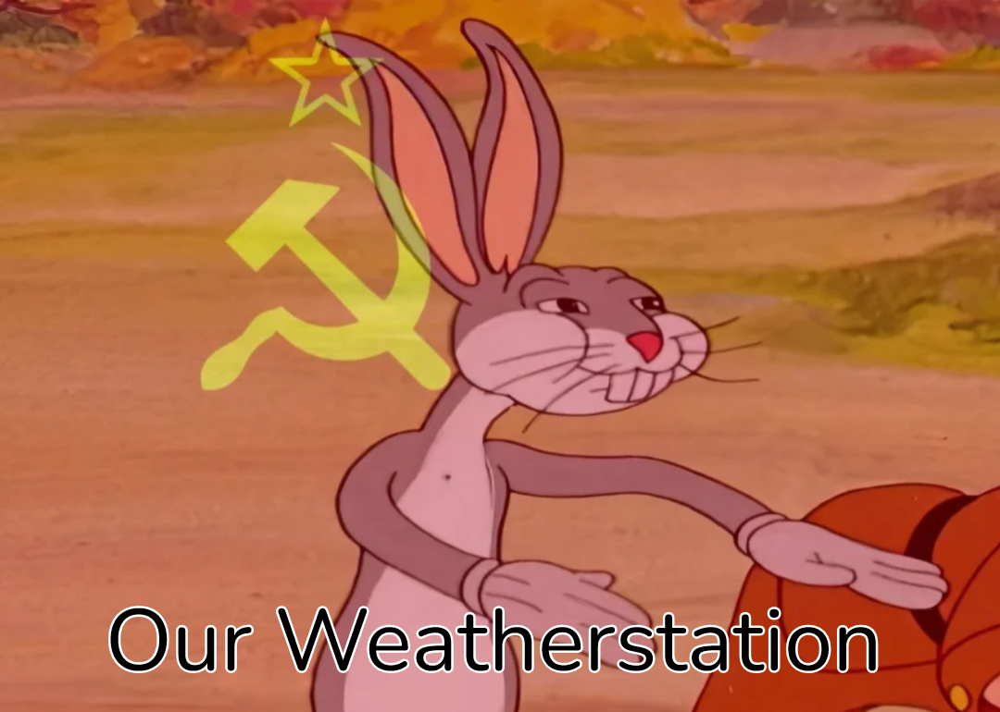
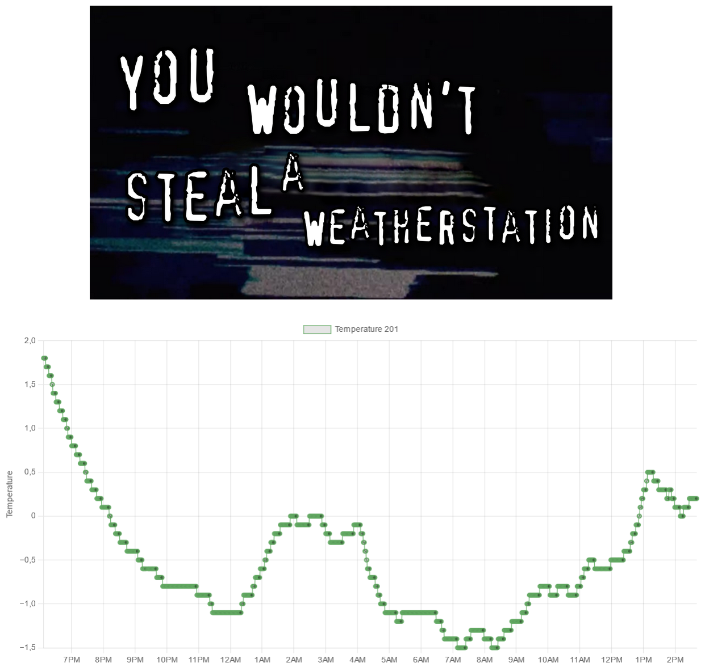

# pirate_temp

If someone in your neighbourhood has a weatherstation, that means you have a weatherstation.



## About the project
This project utilizes an RTL-SDRv3 dongle and the [rtl_433](https://github.com/merbanan/rtl_433) project to listen for (unencrypted) data sent between sensors and the base-station of a specific type of home weatherstation ("Nexus-th", sold by Clas Ohlson in scandinavia). 

This data is saved to an sqlite-database, and plottet in a graph on a website hosted by python flask. Data is displayed in a rolling 24h window.

Project also supports saving and plotting multiple weatherstations, separated by their "id"-parameter.

## Run it!

```bash
python3 app.py
```

## Results
